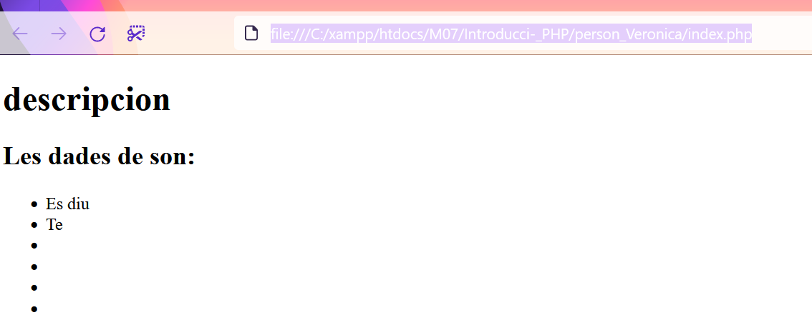

# Introducci-_PHP
1.  Crear un arxiu que contingui HTML i PHP per donar la informació d’una persona la qual haurà de tindre els següents atributs:

* nomAlumne
* cognomsAlumne
* edat de tipus numèric
* data de naixement (cal buscar la funció corresponent per a introduir dates)
* telèfon
* adreça postal
* adreça electrònica
* treballa
* alçada
	
    >Mostrar aquesta persona com una llista (form) en HTML

Caldrà afegir a **captures de pantalla** i a README.md la vostre resposta a l’executar el codi.

        Resposta d’exemple:
       
[enlace_php_introduccion](/file:///C:/xampp/htdocs/M07/Introducci-_PHP/person_Veronica/index.php/)

