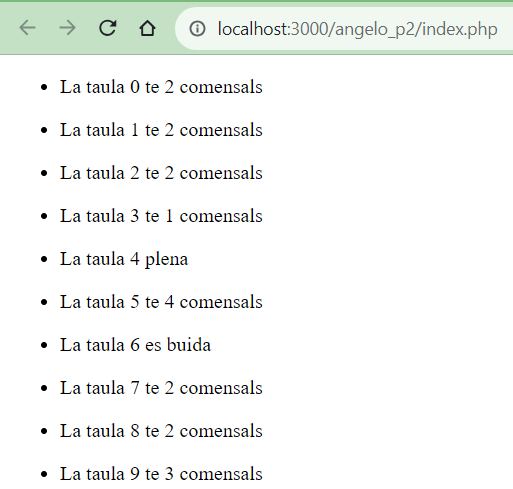
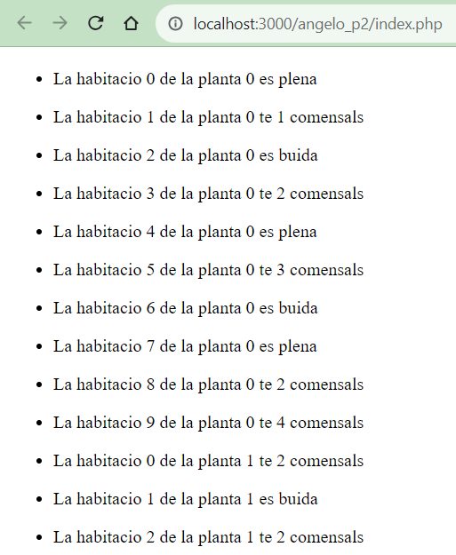
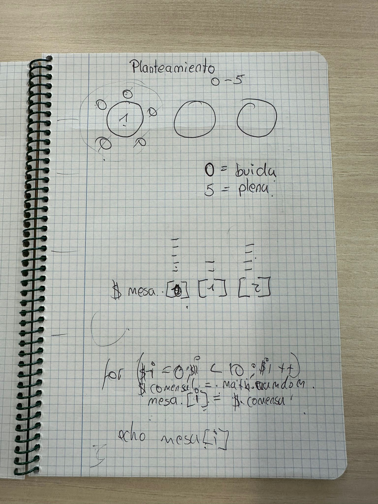
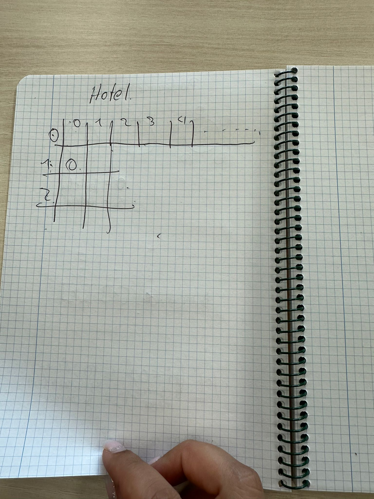

# TRABAJO INDIVIDUAL
## ANGELO MONTENEGRO

Queremos gestionar un hotel, en concreto, las mesas del restaurante y las habitaciones del hotel.
Se debe realizar cada ejercicio en php con HTML

El restaurante estará formado por 10 mesas, donde cada mesa cabe hasta 5 comensales. Queremos una salida a la terminal como:

Recomendación: Haga, individualmente o por parejas, el planteamiento, sin código, de la posible solución del ejercicio. Añadir una foto a capturas de pantalla de esta solución planteada. (10 minutos)

(Ejemplo salidas) - **NO** es necesario mostrar el recuadro

  <ins>Observacions:

  Quan indica “la taula està plena” 
vol dir que té 5 comensals.
  Quan indica “la taula està buida” vol dir que té 0 comensals.  
  S’ha d’utilitzar una array per les taules i els comensals.  
  S’ha d’utilitzar un for per introduir dades a l’array.  
  S’ha d’utilitzar un for amb condicionals per recórrer l’array i mostrar les dades.  
  Mirar la funció [rand](https://www.php.net/manual/es/function.rand.php).  

# TRABAJO GRUPAL
## VERONICA CARTAGENA, ANGELO MONTENEGRO.
* 2.- Se trata de programar la gestión de habitaciones de un hotel. Imagine un hotel con 5 plantas y 10 habitaciones en cada una de las plantas. Se desea guardar el número de clientes que hay en cada habitación. Como máximo puede haber 4 clientes por habitación.

   Es necesario que por parejas haga el planteamiento, sin código, de la posible solución del ejercicio. Añadir una foto a capturas de pantalla de esta solución planteada (10 minutos).

(Ejemplo una parte de la salida)

<ins>Observacions:

Necessitarem utilitzar una array de dues dimensions (una array d’arrays).

## Anexos
 Planteamientos:

 
 