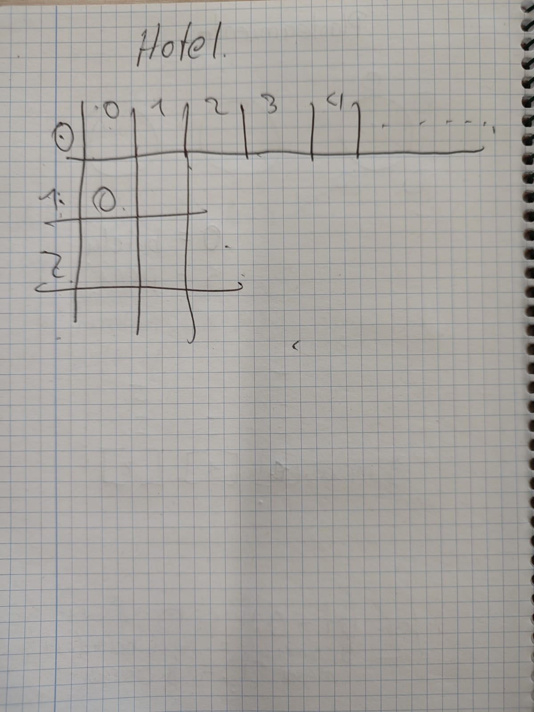
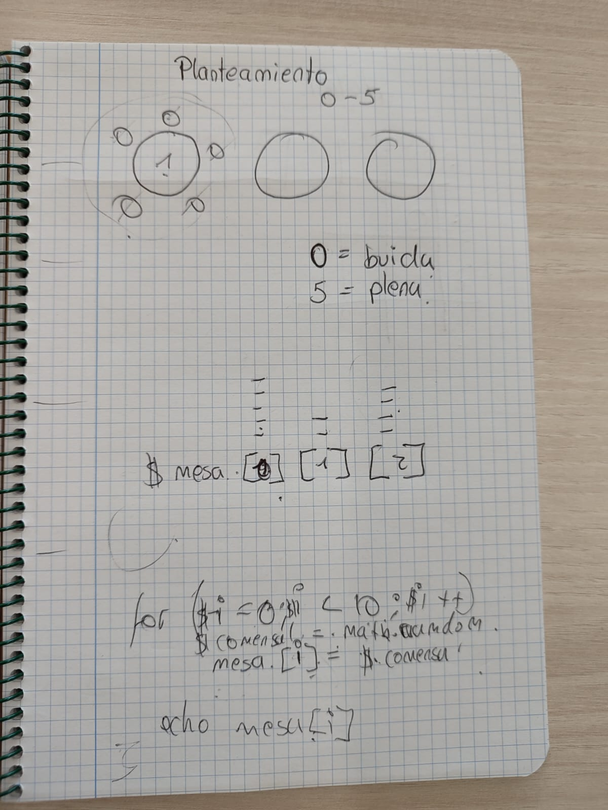

# Trabajo individual
## Veronica Cartagena

Volem gestionar un hotel, en concret, les taules del restaurant i les habitacions de l’hotel.
S’ha de realitzar cada exercici en php amb HTML

* 1.- El restaurant estarà format per 10 taules, on cada taula hi caben fins a 5 comensals. Volem una sortida a la terminal tal que:

  Recomanació: Feu, individualment o per parelles, el plantejament, sense codi, de la possible solució de l’exercici. Afegir una foto a captures de pantalla d’aquesta solució plantejada. (10 minuts)
    (Exemple sortides) - **NO** cal mostrar el requadre

  <ins>Observacions:

  Quan indica “la taula està plena” 
vol dir que té 5 comensals.
  Quan indica “la taula està buida” vol dir que té 0 comensals.  
  S’ha d’utilitzar una array per les taules i els comensals.  
  S’ha d’utilitzar un for per introduir dades a l’array.  
  S’ha d’utilitzar un for amb condicionals per recórrer l’array i mostrar les dades.  
  Mirar la funció [rand](https://www.php.net/manual/es/function.rand.php).  

# Trabajo grupal
## Veronica Cartagena y Angelo Montenegro
* 2.- Es tracta de programar la gestió d’habitacions d’un hotel. Imagineu un hotel amb 5 plantes i 10 habitacions en cadascuna de les plantes. Es vol guardar el nombre de clients que hi ha en cada habitació. Com a màxim hi pot haver 4 clients per habitació.  

  Cal que per parelles feu el plantejament, sense codi, de la possible solució de l’exercici. Afegir una foto a captures de pantalla d’aquesta solució plantejada (10 minuts)..

(Exemple una part de la sortida)

<ins>Observacions:

Necessitarem utilitzar una array de dues dimensions (una array d’arrays).

## Anexos
 Planteamientos:

 
 
