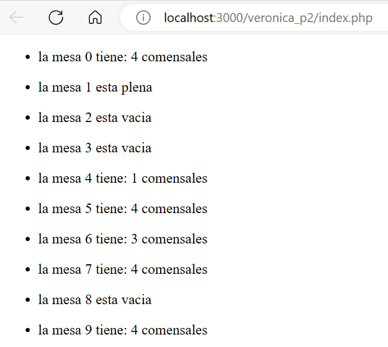

# Ejercicio gestion hotel

* 1.-Volem gestionar un hotel, en concret, les taules del restaurant i les habitacions de l’hotel.
S’ha de realitzar cada exercici en php amb HTML

El restaurant estarà format per 10 taules, on cada taula hi caben fins a 5 comensals. Volem una sortida a la terminal tal que:

Recomanació: Feu, individualment o per parelles, el plantejament, sense codi, de la possible solució de l’exercici. Afegir una foto a captures de pantalla d’aquesta solució plantejada. (10 minuts)

* 2.- Es tracta de programar la gestió d’habitacions d’un hotel. Imagineu un hotel amb 5 plantes i 10 habitacions en cadascuna de les plantes. Es vol guardar el nombre de clients que hi ha en cada habitació. Com a màxim hi pot haver 4 clients per habitació.

Cal que per parelles feu el plantejament, sense codi, de la possible solució de l’exercici. Afegir una foto a captures de pantalla d’aquesta solució plantejada (10 minuts)..

(Exemple una part de la sortida)

