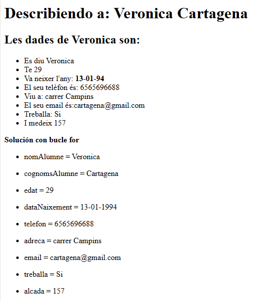

# Introduccion_PHP version2

## Veronica Cartagena

### Enunciado:
1.- Crear un arxiu que contingui HTML i PHP per donar la informació d’una persona la qual haurà de tindre els següents atributs:
* a. nomAlumne
* b. cognomsAlumne
* c. edat de tipus numèric
* d. data de naixement 
* e. telèfon
* f. adreça postal
* g. adreça electrònica
* h. treballa
* i. alçada

    Mostrar aquesta persona com una llista (form) en HTML

Caldrà afegir a captures de pantalla i a README.md la vostre resposta a l’executar el codi.

[enlace_repositorio](https://github.com/cartveroj/Introducci-_PHP/tree/main)